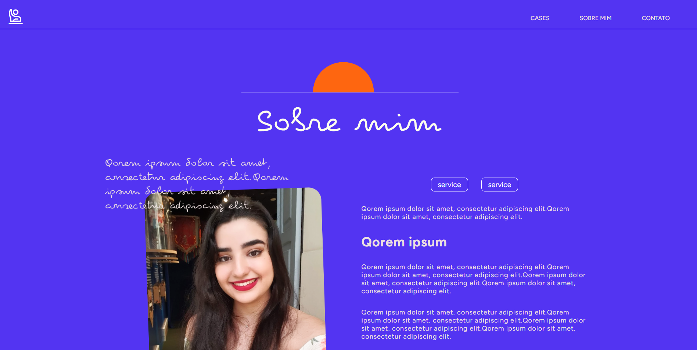

# Atividade 6 - Crosta
Projeto: Portfólio de Design

##Requisitos Não Funcionais

- [Usabilidade]: O site deve ser fácil de usar e navegar, com uma interface intuitiva.
- [Desempenho]:  O site deve carregar rapidamente.
- [Responsividade]: O site deve carregar rapidamente.

##Requisitos Funcionais

- [Tela de Loading/Carregamento]: Deve ser personalizada.
- [Página "Sobre Mim"]: Deve conter informações sobre mim, incluindo experiências e meu histórico.

